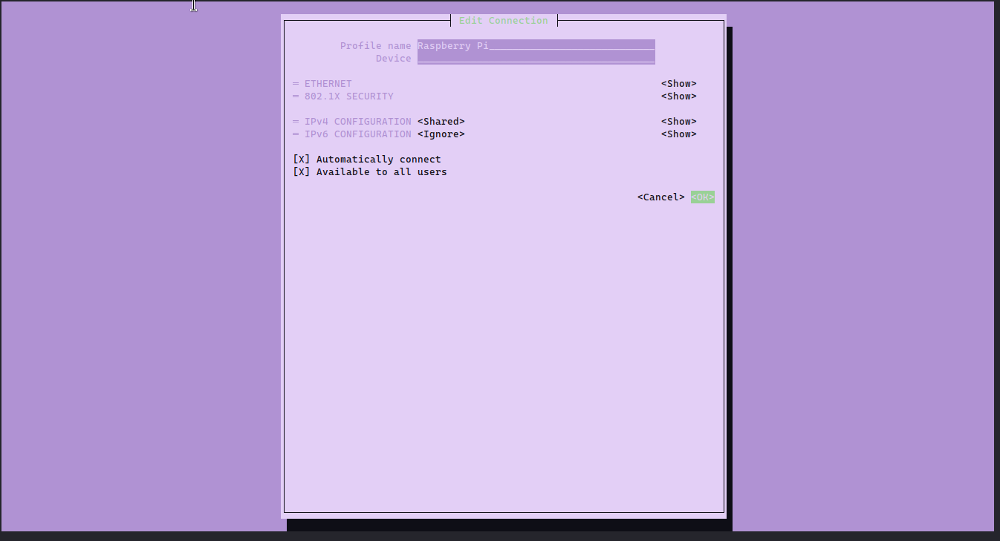
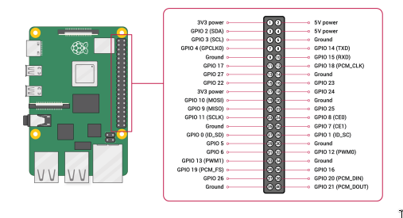
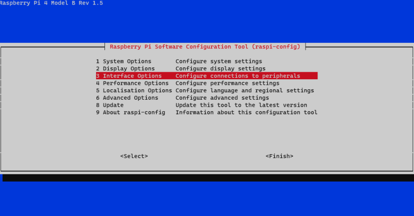
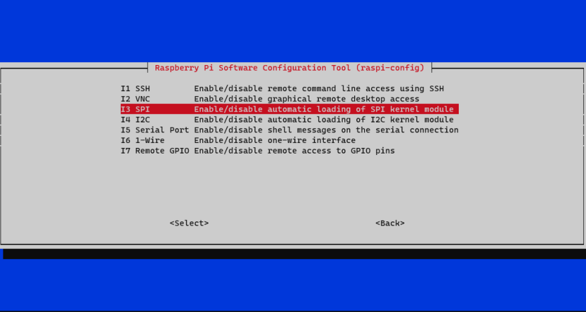

# Memoria Puzzle 1 PBE

## Introducció

L'objectiu d'aquest puzzle és aconseguir la conexió entre la raspberry pi i el lector RFID.

## Connexió a internet

Abans de treballar amb la Raspberry Pi, hem de donar-li connexió a internet. Per tal d'aconseguir connectar-se a internet, cal connectar la Raspberry al portàtil Linux mitjançant un cable ethernet. D'aquesta manera, fent servir `nmtui` es pot crear una connexió ethernet compartida que permet connectar la raspberry a internet. Abans però, cal instal·lar el paquet `dnsmasq`.



<div style="page-break-after: always;"></div>

## Connexió amb el dispositiu

Un cop aconseguit connectar la raspberry a internet, mitjançant `SSH` ja ens podem connectar a la Raspberry. Un cop arribat aqui, per aconseguir connectar el lector RFID-RC522 a la Raspberry Pi hem de connectar els pins corresponents a la Raspberry Pi.

| **PIN RFID** | Pin Raspberry | Funció                                          |
|:------------:|:-------------:|:----------------------------------------------- |
| SDA          | Pin 24        | Serial Data Line                                |
| SCK          | Pin 23        | Serial Clock                                    |
| MOSI         | Pin 19        | Master Out Slave In, enviar data al mòdul RFID  |
| MISO         | Pin 21        | Master In Slave Out, enviar data a la Raspberry |
| GND          | Pin 6         | Cable ground                                    |
| RST          | Pin 22        | Reset                                           |
| 3.3V         | Pin 1         | Power Supply                                    |



Un cop connectat el lector a la Raspberry Pi, hen de centrar-nos en la raspberry pi per completar la connexió.

Per poder comunicar-nos amb el lector, hem de configurar la Raspberry Pi per fer servir el bus spi. Per tal de fer això, hem de connectar-nos via _SSH_ a la placa i fer servir el commandament:

```bash
sudo raspi_config
```

I un cop al menú hem de navegar fins a l'opció de _Interface Options_, i un cop dins d'aquesta opció activar el mòdul SPI.



Un cop activat el mòdul cal reiniciar la placa.

```bash
sudo reboot
```

Ara la placa ja es pot comunicar amb el lector, però per poder programar la seva funció hem d'instalar paquets a la raspberry pi:

```bash
sudo apt-get update
sudo apt-get upgrade
sudo apt-get install python3-dev python3-pip python3-venv
```

| Nom              | Funció                                                          |
|:---------------- | --------------------------------------------------------------- |
| **python3-dev**  | Llibreries necessàries per programar i compilar el fitxer _.py_ |
| **python3-pip**  | Instalador de paquets de Python                                 |
| **python3-venv** | Paquet per generar entorns virtuals de Python                   |
| **spidev**       | Llibreria de python que controla les comunicacions en SPI       |
| **mfrc522**      | Llibreria per controlar el lector RFID-RC522                    |

Amb aquests paquets instalats, ara només ens falta iniciar l'entorn virtual on programarem aquest puzzle.

```bash
mkdir PBE
cd PBE
python3 -m venv env
source env/bin/activate
```

I un cop dins d'aquest entorn virtual podem instal·lar els paquets de python que farem servir per comunicar-nos amb el lector.

```bash
sudo pip3 install spidev
sudo pip3 install mfrc522
```

| Nom         | Funció                                                    |
|:----------- | --------------------------------------------------------- |
| **spidev**  | Llibreria de python que controla les comunicacions en SPI |
| **mfrc522** | Llibreria per controlar el lector RFID-RC522              |

<div style="page-break-after: always;"></div>

## Programa

Aquest codi permet a la Raspberry pi llegir el UID de la targeta

```python
#!/usr/bin/env python

#Importem els ports GPIO i la llibreria MFRC522
import RPi.GPIO as GPIO
from mfrc522 import MFRC522

class Rfid:

    def __init__(self):
        self.lector = MFRC522()
       
    def try_uid(self):
        #Cridant a mètodes de la llibreria MFRC522 intento llegir uid un cop

        (status, TagType) = self.lector.MFRC522_Request(self.lector.PICC_REQIDL)
        if status != self.lector.MI_OK:
            return None
        (status, uid) = self.lector.MFRC522_Anticoll()
        if status != self.lector.MI_OK:
            return None
        return self.uid_to_hex(uid)

    def read_uid(self):
        #Si la crida a uid no ha funcionat, es reintenta fins que funcioni

        uid = self.try_uid()
        while not uid:
            uid = self.try_uid()
        return uid

    def uid_to_hex(self, uid):
        #Reescric el uid resultant en hexadecimal

        n = 0
        for i in range(0,4):
            n = n * 256 + uid[i]
        return hex(n).upper().strip("0X")

    def close(self):
        #Cal tancar els ports GPIO per evitar problemes
        GPIO.cleanup()

if __name__=="__main__":
        rf = Rfid()
        uid = rf.read_uid()
        print(uid)
        rf.close()
```
